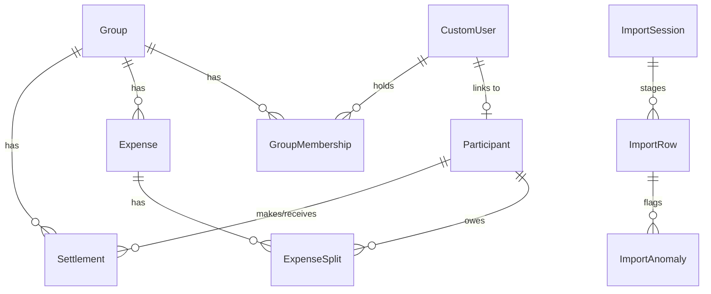

# SCOPE.md - Database Schema and Anomaly Policies

## 1. Database Schema

The application splits data between the active production ledger and the staging tables. This prevents raw, corrupted, or erroneous CSV uploads from polluting the database before administrative confirmation.

### Production Tables

#### `accounts.CustomUser`
* `id` (Auto-Increment, Primary Key)
* `email` (EmailField, Unique, Login identifier)
* `name` (CharField, Full Name)
* `role` (CharField, Choices: `ADMIN`, `MEMBER`, Default: `MEMBER`)

#### `accounts.Participant`
* `id` (Auto-Increment, Primary Key)
* `name` (CharField, Unique, Name as it appears in splits)
* `user` (OneToOneField to `CustomUser`, Nullable, blank if external)
* `is_external` (BooleanField, True if not linked to a registered account)

#### `groups.Group`
* `id` (Auto-Increment, Primary Key)
* `name` (CharField)
* `created_by` (ForeignKey to `CustomUser`)
* `created_at` (DateTimeField)

#### `groups.GroupMembership`
* `id` (Auto-Increment, Primary Key)
* `group` (ForeignKey to `Group`)
* `user` (ForeignKey to `CustomUser`)
* `joined_at` (DateField)
* `left_at` (DateField, Nullable)
* `role` (CharField, choices: `ADMIN`, `MEMBER`)

#### `expenses.Expense`
* `id` (Auto-Increment, Primary Key)
* `group` (ForeignKey to `Group`)
* `description` (CharField)
* `amount` (DecimalField, 12, 2)
* `currency` (CharField, max 3)
* `expense_date` (DateField)
* `paid_by` (ForeignKey to `Participant`)
* `split_type` (CharField, choices: `EQUAL`, `PERCENTAGE`, `SHARES`, `EXACT`)
* `status` (CharField, choices: `ACTIVE`, `DRAFT`, `INACTIVE`, Default: `ACTIVE`)
* `original_amount` (DecimalField, 12, 4, Nullable)
* `original_currency` (CharField, max 3, Nullable)
* `exchange_rate` (DecimalField, 12, 6, Nullable)
* `import_session` (ForeignKey to `ImportSession`, Nullable)
* `import_row_number` (IntegerField, Nullable)

#### `expenses.ExpenseSplit`
* `id` (Auto-Increment, Primary Key)
* `expense` (ForeignKey to `Expense`)
* `participant` (ForeignKey to `Participant`)
* `share_amount` (DecimalField, 12, 2)
* `share_percentage` (DecimalField, 5, 2, Nullable)
* `share_ratio` (DecimalField, 5, 2, Nullable)

#### `settlements.Settlement`
* `id` (Auto-Increment, Primary Key)
* `group` (ForeignKey to `Group`)
* `payer` (ForeignKey to `Participant`)
* `receiver` (ForeignKey to `Participant`)
* `amount` (DecimalField, 12, 2)
* `currency` (CharField, max 3, Default: `'INR'`)
* `date` (DateField)
* `import_session` (ForeignKey to `ImportSession`, Nullable)
* `import_row_number` (IntegerField, Nullable)

### Staging Tables

#### `imports.ImportSession`
* `id` (Auto-Increment, Primary Key)
* `uploaded_by` (ForeignKey to `CustomUser`)
* `group` (ForeignKey to `Group`)
* `file_name` (CharField)
* `status` (CharField, choices: `PENDING_REVIEW`, `IMPORTED`, `REJECTED`)
* `created_at` (DateTimeField)

#### `imports.ImportRow`
* `id` (Auto-Increment, Primary Key)
* `session` (ForeignKey to `ImportSession`)
* `row_number` (IntegerField)
* `date`, `description`, `paid_by`, `amount`, `currency`, `split_type`, `split_with`, `split_details`, `notes` (Raw CharFields)
* `resolved_date` (DateField, Nullable)
* `resolved_description` (CharField, Nullable)
* `resolved_paid_by_name` (CharField, Nullable)
* `resolved_amount` (DecimalField, Nullable)
* `resolved_currency` (CharField, Nullable)
* `resolved_split_type` (CharField, Nullable)
* `resolved_split_with` (TextField, Nullable)
* `resolved_split_details` (TextField, Nullable)
* `resolved_notes` (TextField, Nullable)
* `original_amount`, `original_currency`, `exchange_rate` (Nullable numeric audits)
* `status` (CharField, choices: `PENDING`, `RESOLVED`, `REJECTED`)
* `is_imported` (BooleanField)
* `is_settlement` (BooleanField)

#### `imports.ImportAnomaly`
* `id` (Auto-Increment, Primary Key)
* `session` (ForeignKey to `ImportSession`)
* `row` (ForeignKey to `ImportRow`)
* `type` (CharField)
* `severity` (CharField, choices: `INFO`, `WARNING`, `ERROR`)
* `raw_value` (TextField)
* `suggested_fix` (TextField)
* `decision` (CharField, choices: `PENDING`, `APPROVED`, `REJECTED`, `EDITED`)
* `is_resolved` (BooleanField)

---

## 2. CSV Anomaly Handling Policies

| # | Anomaly Category | Description / Example | Severity | Default Action Taken | Handling Policy |
|---|---|---|---|---|---|
| 1 | **Currency Mismatch** | Row has USD currency | `WARNING` | Auto-Convert + Keep original | Converts to INR at configured rate (83.00), storing conversion audit values. |
| 2 | **Exact Duplicate** | Exact matching row date/amount/payer/splits | `WARNING` | Flag for Approval | Staged and flagged. Requires admin to hit Approve or Reject Row. |
| 3 | **Conflicting Duplicate** | Same date/payer/splits, different amount | `ERROR` | Block row | Blocked. User must resolve by editing the row or rejecting it. |
| 4 | **Numeric Formatting** | Amount contains commas (`1,200`) or decimals | `INFO` | Auto Fix | Strip commas, trim, and round using Round Half Up. |
| 5 | **Name Normalization** | Whitespace or case issues (`priya`, `rohan `) | `INFO` | Auto Fix | Trim spaces and match casing against registered participants. |
| 6 | **Alias Mapping** | Name with initial (`Priya S`) | `WARNING` | Require Approval | Matches base name. Flagged as warning, resolved on approval. |
| 7 | **Missing Payer** | `paid_by` column is empty | `ERROR` | Block row | Creates draft expense. Requires User Input to assign correct payer. |
| 8 | **Missing Currency** | Empty currency string | `WARNING` | Review | Suggests `INR` and flags for admin confirmation. |
| 9 | **Settlement as Expense** | Description matches `paid back`, `repaid`, etc. | `WARNING` | Auto-Convert | Flags `is_settlement=True` to create a Settlement rather than Expense. |
| 10| **Invalid Percentages** | Percentages sum to `110%` | `ERROR` | Block row | Blocked until user edits the split details to sum to exactly 100%. |
| 11| **Split Metadata Conflict**| Split type `equal` but details supplied | `ERROR` | Block row | Blocked. Requires admin to select Split type or remove details. |
| 12| **Date Parsing** | Date in format `01/03/2026` or missing year | `WARNING` | Review | Parse if unambiguous. Flag warning if ambiguous for user confirmation. |
| 13| **Membership Violations** | Member left group but included in splits | `WARNING` | Review | Flag warning. Balance calculator will exclude splits outside active dates. |
| 14| **External Participants** | Participant not in group memberships | `INFO` | Auto-Create | Creates an external Participant record (without account credentials). |
| 15| **Zero Amount** | Amount is `0` | `WARNING` | Review | Imports as INACTIVE expense, automatically excluded from balance pools. |
| 16| **Negative Amount** | Amount is negative (`-30`) | `INFO` | Auto Fix | Treated as a negative refund expense (credits split members, debits payer). |
